<!DOCTYPE html>

<title>16-726 Final Project</title>

 16-726 Final Project: Curve-based Image Editing and Style Transfer

Sean Chen (yuhsuan2)

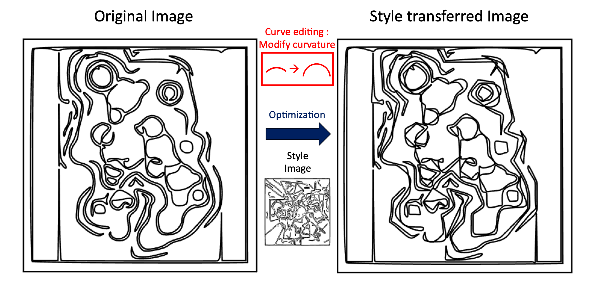

Motivation: 

In previous assignment 4, I learned that Neural Style Transfer is able to achieve amazing results
on transferring one image's style to another image. However When I also observed that transferring binary sketch images' style
onto another picture is often less successful, and can even fail badly that makes the content image disappear (Figure 1). 

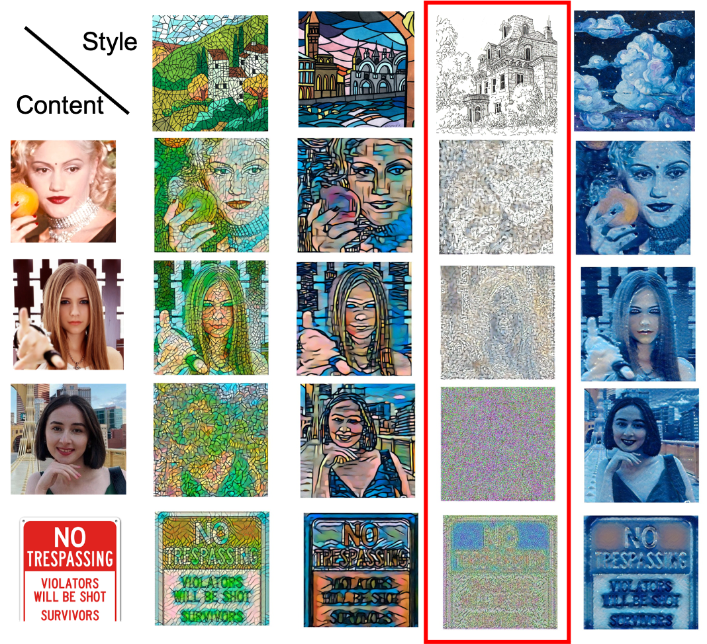

Figure 1: Neural style transfer results

This is happening because binary images have one less information (color gradients) than other images, and the pretrained VGG19 
as the style-capturing tool might not be well-trained on binary images. I then had an idea: what if we perform style transfer using
curve-based images, with explainable curve editing rules? This way, the curve's intergrity will still be presereved,
 and might achieve better results on sketch-based style images (Figure 2). 

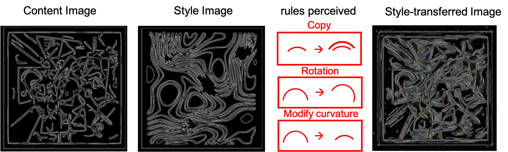

Figure 2: Curve style transfer idea.

The main difference of curve-based image style transfer is that instead of optimizing a combination of content loss and style loss, 
it will only optimize the style loss. However since the image is generated from the content image by modifying curves with shape rules,
its degree of freedom is limited, and we can ensure that the original contents will still be preserved (Figure 3). Another potential advantage
 of curve-based style transfer, is that we are fully aware what has happened to each individual curves, which will have way better 
 interpretability then neural style transfer.

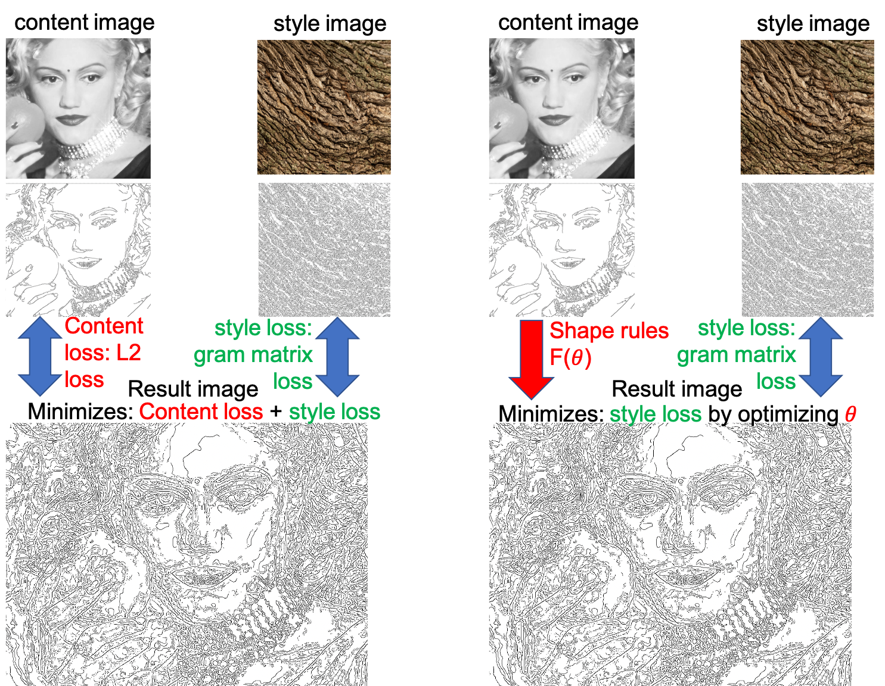

Figure 3: Style transfer comparison. left: neural style transfer, 
	right: curve-based style transfer.

Methods

To implement curve style transfer,I implemented the following steps:

1. Pixel Image preprocessing

Since the majority of images are pixel images, I found it necessary to create an image processing pipeline to vectorize images.

2. Curve editing rules implementation

Make curve editing rules to edit content image, and visualize the editing effects. Note that this has to be a differentiable operation.

3. Loss function design & differentiable rendering

To optimize an image's style, I need to develop a loss function. In this project, I made an algorithm to differentiably render 
curve-based images onto a pixel canvas, so that I can get style loss using neural style transfer's pipeline.

4. Toy problem on reconstruction optimization

Build a toy problem to verfy the feasibility of this methodology. Fisrt, select a curve-based image (as the content image) and modify
 it using shape rules with some parameters {t_style} (as the style image), and see if the optimization pipeline can converge the values {t_learned} 
 to the style image's {t_style}.

5. Curve-based style transfer implementation

Combining step 1~3, and use the pipeline developed from step 4 to perform style transfer. The style-perception model used in this project
 is VGG19.

6. Hyperparameter tuning

Tune parameters including: 
image processing parameters (image, image size, padding color, margin, scaling, etc), 
rendering parameters (thickness, number of sampling points, etc), 
optimization parameters (learning rates, optimizer, scheduler, style layers)

The follwing chapter will explain these steps in details.

Implementation Details

1. Pixel Image preprocessing

The pipeline of an image with an object is shown in Figure 4.

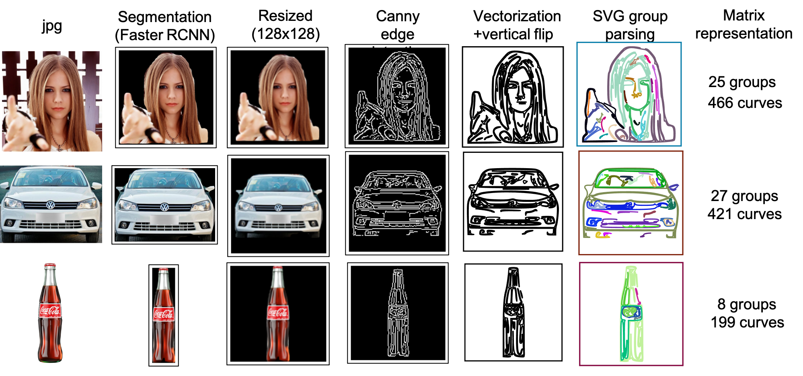

Figure 4: image processing pipeline on objects.

The pipeline for paintings, since they don't have objects to detect, I skipped
the segmentation step. (Figure 5)

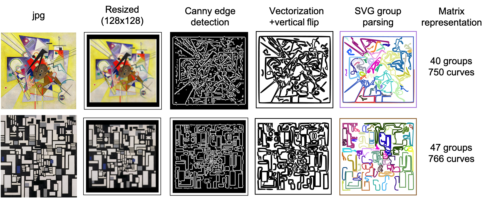

Figure 5: image processing pipeline on paintings.

2. Curve editing rules implementation

Since the foundation of curve-based style transfer is based on the variety of shape rules, I first listed out some shape rules (Figure 6)
 and implemted as many as I can in the time I have.

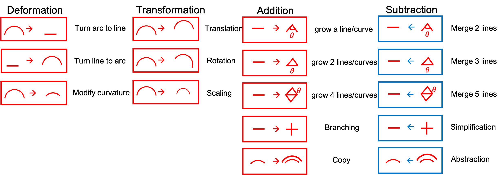

Figure 6: List of curve rules.

I first developed transformation rules on curve-based images: (Figure 7)

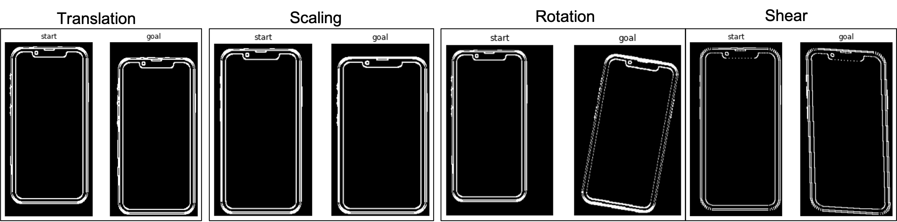

Figure 7: transformation rules.

I then also made a rule to modify image's curvature: (Figure 8)

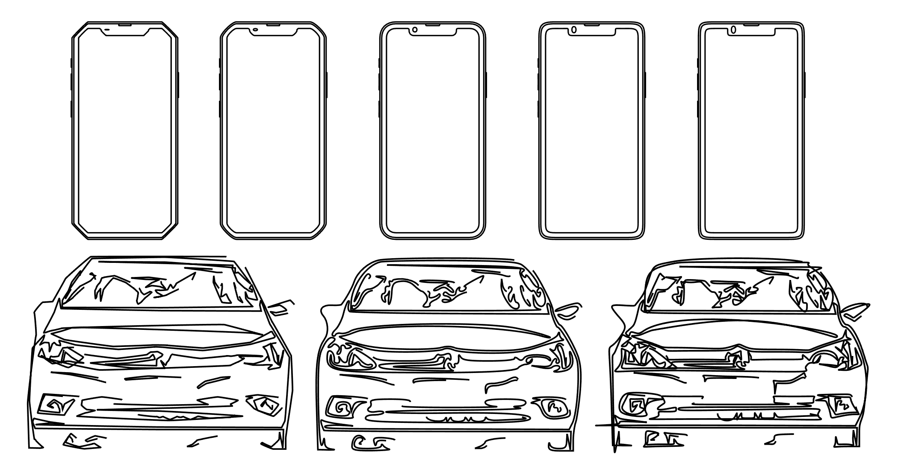

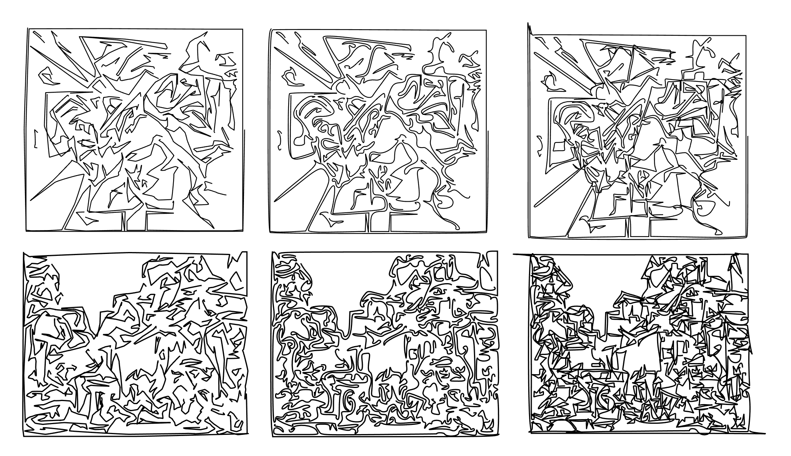

Figure 8: Curvature modification.

I then made algorithms on offsetting the curves: (Figure 9)

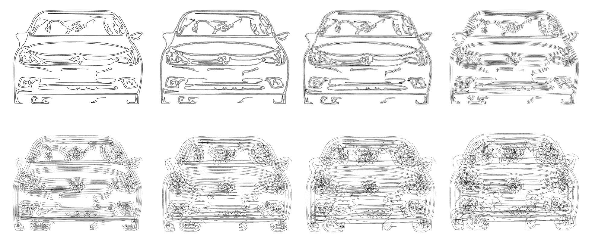

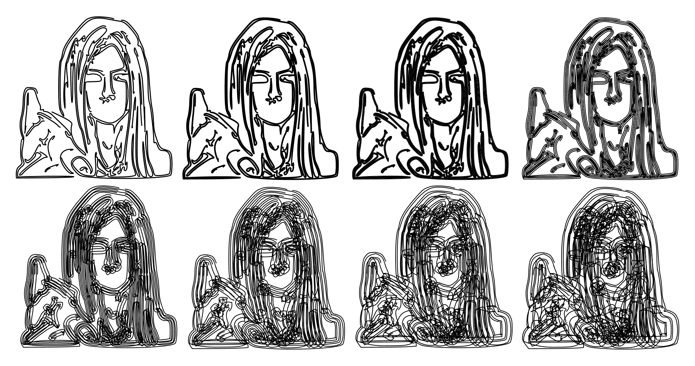

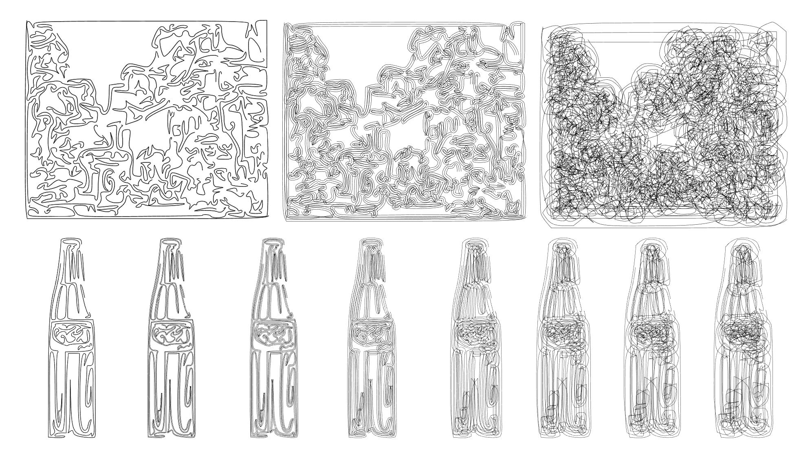

Figure 9: Curve offset.

Here are animations of tuning parameters of shape rules: (Figure 10)
<table width="100%">
	<tbody>
		<tr valign="top">
			<td>

mod_crv
</td>
			<td>

xscale
</td>
			<td>

xshear
</td>
			<td>

rotate
</td>
			<td>

offset
</td>
		</tr>
	</tbody>
</table>

Figure 10: Animation.

At last, I made the shape rules compatible to be applied sequentially: (Figure 11)

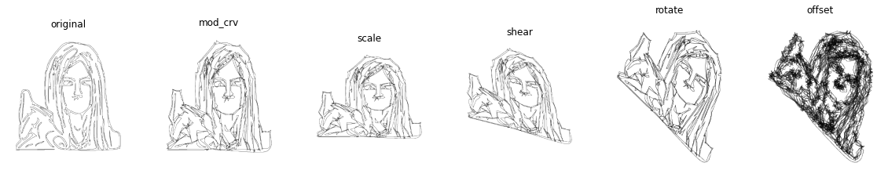

Figure 11: sequentially apply curve rules.

3. Loss function design & differentiable rendering

In this project, I choose to use differentiable wireframe developed in LayoutGAN (2019 Li et al) to render my curve-based data, so I can apply pixel-based 
pretrained model like vgg19 at a later step of the pipeline on rendered pixel images. (Figure 12) The algorithm was modified to apply on cubic bezier curves.

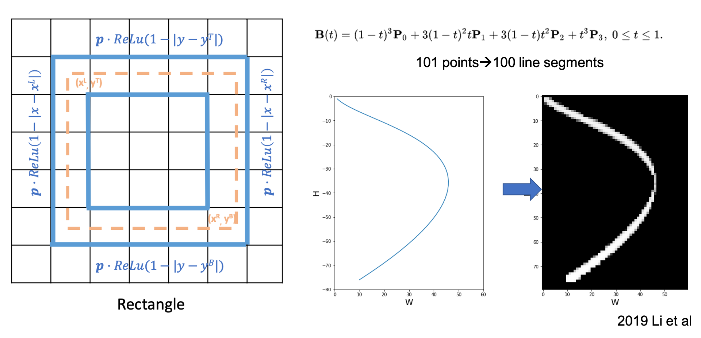

Figure 12: Differentiable rendering bezier curves.

One unexpected yet major challenge I had to face in this project is the limitation of computational power. 
Using my original code, I render an image curve by curve and iteratively add it onto the canvas. It works perfectly for small images like 
a cola bottle or a phone. However, if I render an image that has more than 100 curves, it is very likely to take more than 5 minutes
 just to render. 
Therefore, I rewrote the code in matrix form (linear algebra) and utilize GPU, and it did dramatically speed up the rendering process
(<10 secs for a 100 curve iamge). However, this rendering process will cost a lot of storage, therefore when rendering images larger than 
rendering method, this will again fail due to not enough GPU memory. 
At last, I found a good balance between this tradeoff. By iteratively rendering batches of curves at a time in GPU and throwing it back to 
CPU, I was able to render images as large at 700 curves within 10 seconds. (Figure 13)

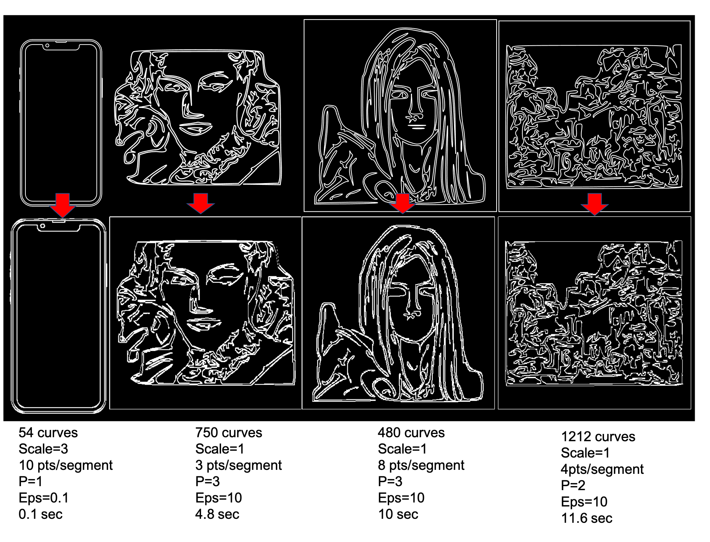

Figure 13: Render parameters and results of several images.

4. Toy problem on reconstruction optimization

Since reconstruction optimization has a one and only ground truth, I think even though I am eventually not using it in the curve-based style transfer
problem, these toy problems are still important to verify the concept, that optimizing curve rule parameters can lead to valid results.
Respectively from easy to hard, I build 3 toy problems with rectangles(curvature), phones(curvature), and Avril(curvature, height, width)
(Figure 14).

<table width="100%">
	<tbody>
		<tr valign="top">
			<td>

optimization task
</td>
			<td>
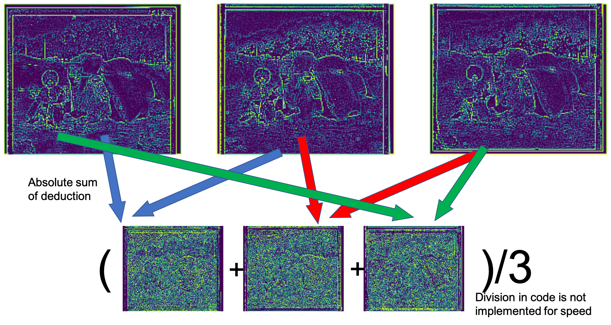

loss curve
</td>
		</tr>
	</tbody>
</table>

Figure 14: optimization process

The main takeaways of this experiment is that this optimization process is very sensitive. However, there are several ways that can make 
the process more robust: 
&emsp; 1. Optimizer: SGD works a lot better than Adam(which 
mostly explodes), and for multiple variables, Adagrad may be better than SGD. 
&emsp; 2. It is crucial to set customized learning rates for each parameter, and for each optimization problem. 
&emsp; 3. Adding CNN layers (for example, max pooling) and sum up the image loss for different layers is crucial for more complicated 
(many curves, many parameters) to not explode. 
&emsp; 4. Using a step scheduler will also help converge, however one must be aware to not decrease the LR too fast to avoid local minimum.

5. Curve-based style transfer implementation

At the last step, I imported the pretrained VGG19 and performed curve-based style transfer. Here are some successful results below
(Figure 15, 16, 17). I also put the results of neural style transfer to show that for binary sketch images, curve style transfer works better.

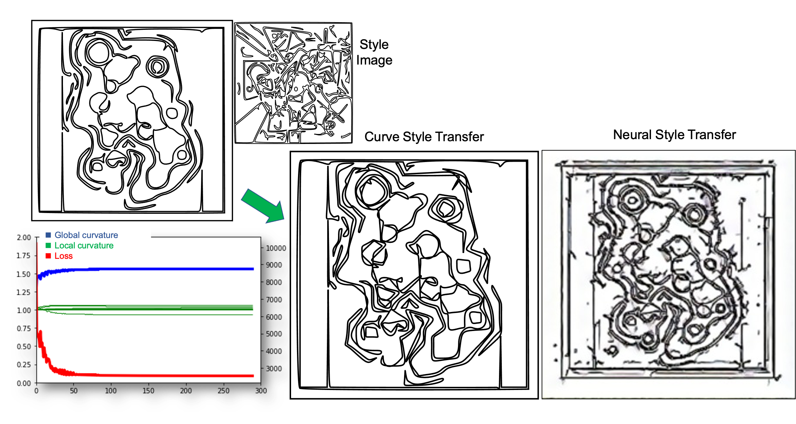

Figure 15: Style transfer comparison result 1

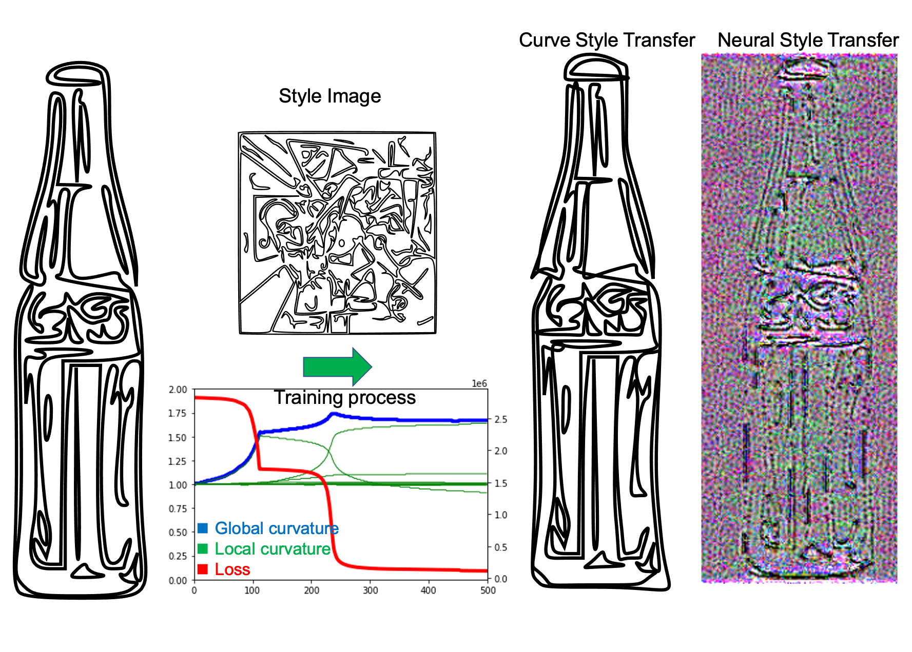

Figure 16: Style transfer comparison result 2

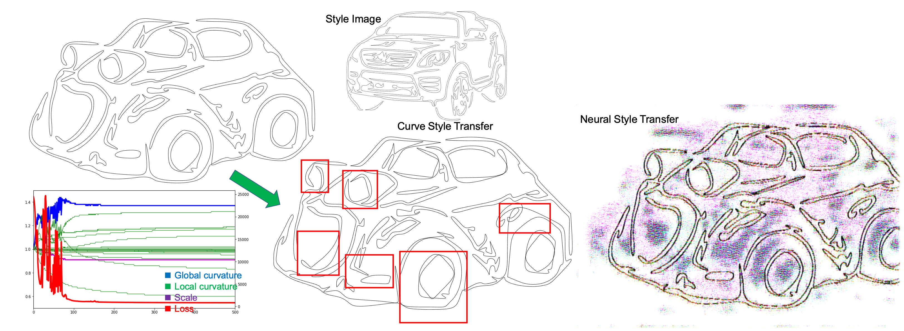

Figure 17: Style transfer comparison result 3. The red regions are when the curves got modified.

6. Hyperparameter tuning

The main takeaways of this experiment is that this optimization process is very sensitive. However, there are several ways that can make 
the process more robust: 
&emsp; 1. Choose the suitable background color (usually black or white) can remove unnecessary curves. 
&emsp; 2. Do segmentation if possible, which will remove a lot of redundant noises. 
&emsp; 3. Rendering scaleas big as possible (as long as GPU can compute): Due to GPU limitation, for images that have >400 curve, I can only render them on a 128x128 canvas, 
which can lose a lot of information. 
&emsp; 4. The style image can have many curves, but content image should be <400 to get good results. 
&emsp; 5. If loss explode, decrease lr. If loss not changing, increase lr.

Future works

The main contribution of this project is the novelty of applying style transfer on images using shape grammars. Since it's just a prototype
to prove the concept that curve-based style transfer is possible, there are many aspects that can be developed in the future to 
achieve better results, and I will list them below in the order of the pipeline: 
&emsp; 1. Image preprocessing: The vectorization pipeline can still be improved to produce less curves. Methods include: padding color 
blending (so no edge will be detected at the frame), edge detection involving high/low pass filters, or use ML methods to perform 
edge detection(https://carolineec.github.io/informative_drawings/). An additional extension is to save
the images with colors, which may be a good additional information for better results and wider applications. 
&emsp; 2. Curve rules: Currently, the optimization pipeline has a limitation of styles that can be successfully transferred, and one of the 
reasons is that there are too few rules that I develop and allow, which restricts the degree of freedom very much. In my opinion, the rules 
to simplify(like merging) and complicate(like offset) curves are most crucial for wider applications and variations. One important notable is
that all developed rules have to be differentiable in order to be optimized. 
&emsp; 3. Differentiable rendering: The original paper (2019 Li et al) used this rendering method only on line segments, and their images rarely
 has to deal with more than 100 curves per image. In my case, however, since I very often render more than 400 Bezier curves (which I consider 
 each curve as 4~6 line segments), the computational cost is way heavier (ex: an 128x128 image with ~450 curves will use ~20 GB). This limits
 my image quality in every aspect (smoothness, appearance on canvas)(Figure 18). This will also prohibit me from building generative curve rules. 
 While having a very strong GPU can definitely increase the rendering physical ceiling, a better usage of regulating GPU power in my
  current algorithm is necessary. 

Figure 18: Currently, the rendered image quality is very low due to CPU/GPU limitations, which can make the optimization process very challenging.

&emsp; 4. Style-capturing model improvement: In this project, I continued my work from previous assignment, which usesd VGG19 as the style 
perception tool. However, it is not mainly trained on skecth images. Therefore, results might be greatly improved if I use other types of 
neural network, for example CLIP, which has a much better accuracy on skectch images than Imagenet Resnet101(https://openai.com/blog/clip/). 
Another potential development of this project is to train a curve-based classification network in curve base. The advantage of this method 
is not only will it capture "curve" information better, but it can also save the computational cost from rendering curve-based images. 
&emsp; 5. Hyperparameter tuning: Although I did not plan to use pixel content loss as part of the optimization problem, I also intend to try 
tuning it and see what results will it bring out. Another tricky tuning thing I found was that every content-style image pair has their own 
learning rates that has to be customized, and in the future I hope I can find the root cause of this and can automatically choose the 
suitable parameters for each problem. Another thing I want to try is to start at multiple different starting point and choose the one that 
has the lowest style loss as the final result. This is because the optimization process is so sensitive that I suspect there are multiple local 
minimum, and I have no idea whether I am stuck in one of them. 
&emsp; 6. Explainability: The advantage of using curve-based style transfer is that it offers great explainability on eahc curve's contribution 
and their modification parameters. Therefore, I believe that doing an ablation study to visualize the curves that are most modified can 
definitely show some coherent yet interesting results, which can help us better answer the question "what makes a style a style".(Figure 19) 

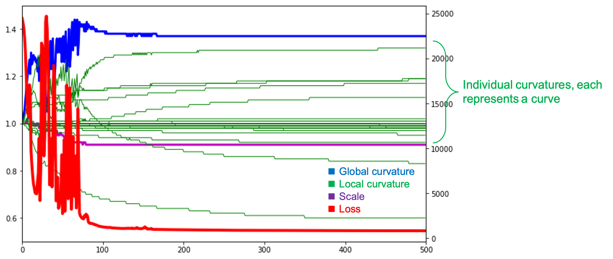

Figure 19: By visualizing the curves that are more modified than others, we might be able to better interpret "what makes a style a style?".

&emsp; 7. Others: More learnable properties, including segments' thickness, slope threshold (determine whether to render a line as a 
vertical-horizontal-general segment), can actually be learnable and become one of the many shape grammars. Another extension that has a strong 
potential is do apply curve rules only on specific shapes. This may be implemented using shape detection algorithms like openCV, and the 
reason that this is useful is that it can allow better attention on localized regions, which should provide better style transfer results.

Acknowledgement

First of all, I want to thank my advisors Prof. Cagan and Prof. Kara for bringing me the idea about shape grammars and style transfer.  
I would also like to thank the instructors in 16726 (Prof. Jun-yan and Sheng-yu) that enlights me with state-of-the-art learning-based image 
synthesis methods, and the instructors in 62706 (Prof. Ramesh and Jinmo) to introduce me with conventional generative systems in design.

