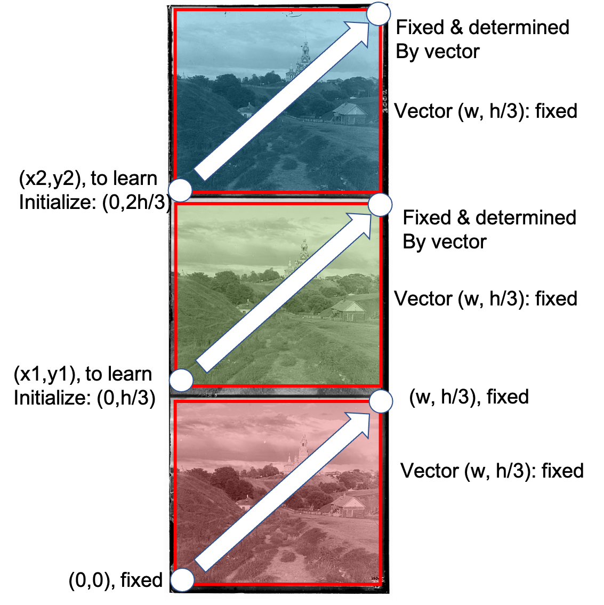
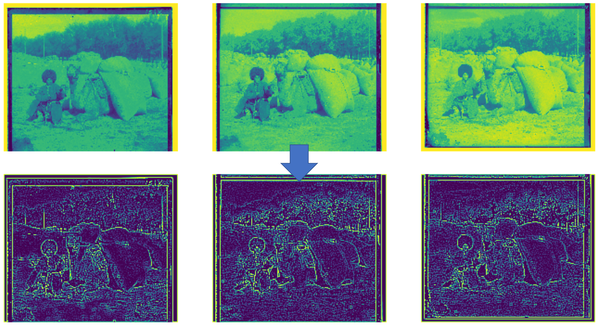
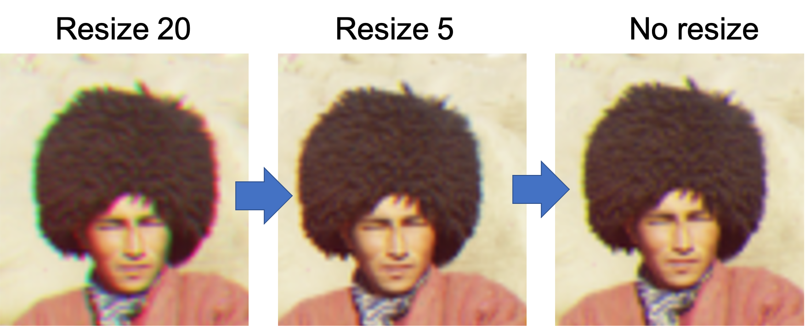
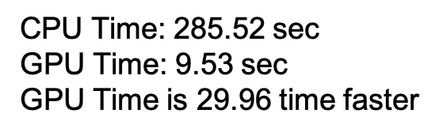
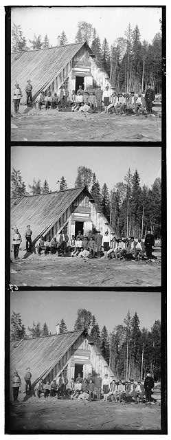
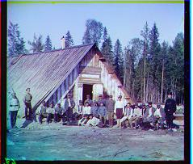
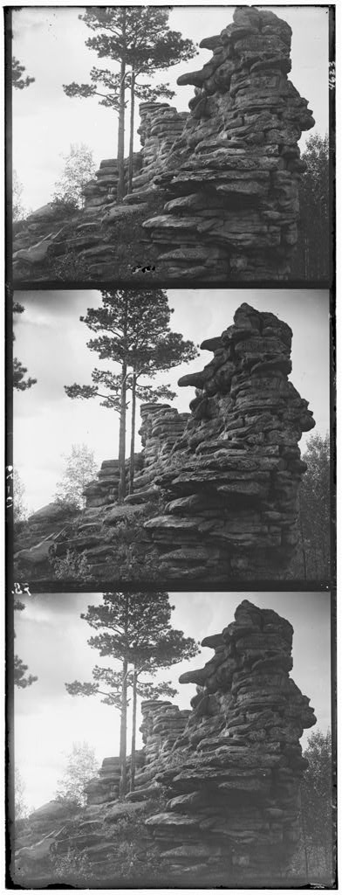
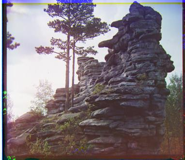

<!DOCTYPE html>
<html>
<head>
</head>
<body>

<h1>BIGNet - Phone</h1>
<h4><a href="https://drive.google.com/file/d/1qFROn8uz7wG6HjcUkMC8Rdc0atgCuA22/view?usp=share_link">[Paper]</a></h4>

This page is the implementation of BIGNet in the phone case study. Car case study implementation can be found <a href="https://github.com/parksandrecfan/bignet-car"><b>here</b>.

<h2>Project summary</h2>

Identifying and codifying brand-related aesthetic features for produc redesign is essential yet challenging, even for humans. This project demonstrates a deep learning, data-driven way to automatically learn brand-related features through SVG-based supervised learning, using brand identification graph neural network (<b>BIGNet</b>), a hierarichal graph neural network.

Our approach conducting the phone study can be summarized in this flow chart:

<h2>System requirements</h2>

The hardware information can be found in Hardware Overview.txt.

The required (Python) packages can be found in requirements.txt.

1: Learning parameters: 2 points' coordinates (4 values) that defines the anchor point for blue and green images, to match the red one 

Note that to fix red image's anchor point is to reduce the usage of for loops, and the fact that width and height doesn't have to be learned is because the problem states that all pictures should be the same size.  

<h2>3. Anchor parameters</h2>

Since I didn't loop through anchor point for red images, I have to allow x1 and x2 to potentially be negative. I also need to make sure all the points for cropping wouldn't exceed image's boundary. Therefore, I actually crop the image based on the anchor points plus a buffer. On the left side, the buffer is positive shift, and on the right side the it's called border_sum. 

<h2>4. Loss</h2>

First, I use an edge finding approach that is similar to a matrix like [[-1,-1,-1][-1,9,1][-1,-1,-1]]. I then compare the 3 channels' edge images with the loss I made up.

I adopted a loss that is similar to the algorithmic loss for the 3 colors, because it not only works very well, but it also is much faster than calculating L2 norm or NCC.

<h2>5. Pyramid structure: </h2>

To run the full resolution for .tif files is too time consuming. Therefore, I made a 3-tier downsampling structure to make the process less than 1 minute. First, I downsample the images with a scale of 20, get the approximate anchor point, then downsample it with a scale of 5, and at last use the original resolution.

One thing to note is that I directly use 1 tier structure on .jpg because it is actually faster.

From the picture below, you can see how the quality is improved when I use better resolutions.

<h2>6. Other speed-up tricks </h2>

Since images preserves continuity, aligning a section of the image is equally effective as aligning a whole image, and it's faster. Therefore, I used speedup_sum to define the area I was actually aligning, which is a little smaller than the actual image, but it works well and runs way faster. At last, I was able to run a .tif image within 45 seconds.

<h2>7. Display result </h2>

cathedral.jpg final offset: 

result: 

emir.tif final offset: 

result: 

harvesters.tif final offset: 

result: 

icon.tif final offset: 

result: 

lady.tif final offset: 

result: 

self_potrait.tif final offset: 

result: 

three_generations.tif final offset: 

result: 

train.tif final offset: 

result: 

turkmen.tif final offset: 

result: 

village.tif final offset: 

result: 

<h2>8. Additional results </h2>

60 plate final offset: 

original: 

result: 

rock final offset: 

original: 

result: 

</body>
</html>
