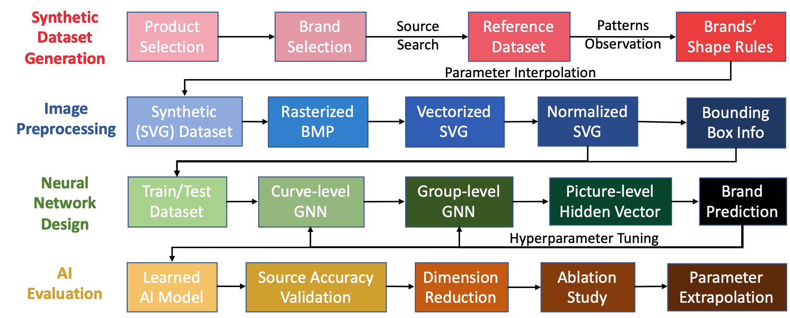
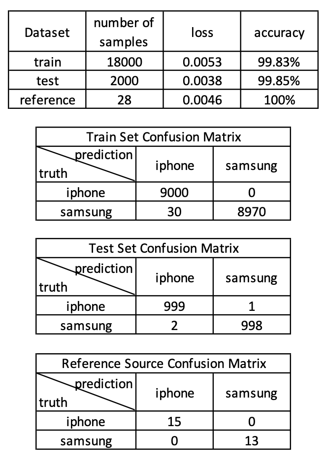
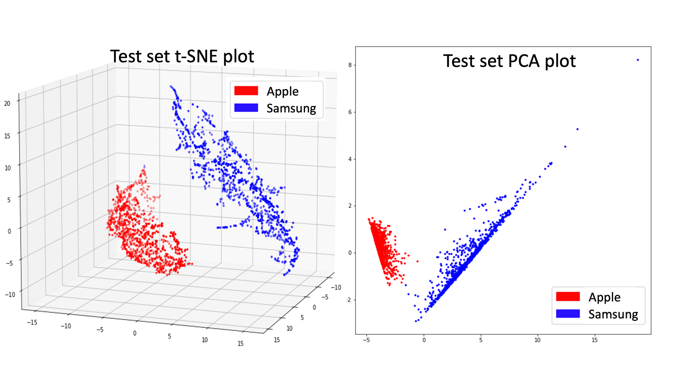
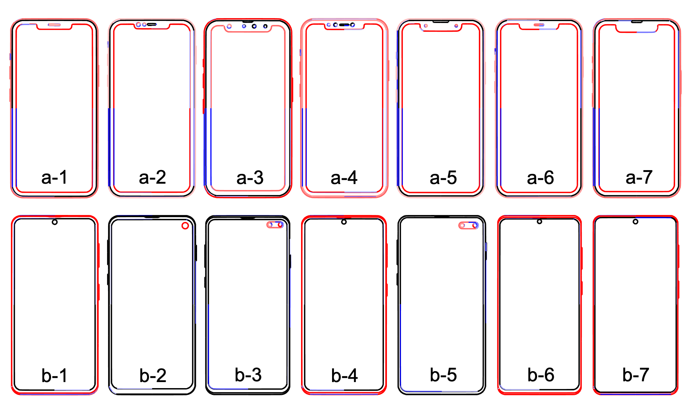

<!DOCTYPE html>
<html>
<head>
</head>
<body>

<h1>BIGNet - Phone</h1>
<h4><a href="https://drive.google.com/file/d/1qFROn8uz7wG6HjcUkMC8Rdc0atgCuA22/view?usp=share_link">[Paper]</a></h4>

This page is the implementation of BIGNet in the phone case study. Car case study implementation can be found <a href="https://github.com/parksandrecfan/bignet-car"><b>here</b>.

<h2>Project summary</h2>

Identifying and codifying brand-related aesthetic features for produc redesign is essential yet challenging, even for humans. This project demonstrates a deep learning, data-driven way to automatically learn brand-related features through SVG-based supervised learning, using brand identification graph neural network (<b>BIGNet</b>), a hierarichal graph neural network.

Our approach conducting the phone study can be summarized in this flow chart:

<h2>System requirements</h2>

The hardware information can be found in Hardware Overview.txt.

The required (Python) packages can be found in requirements.txt.

<h2>Instruction</h2>

An easy-to-follow process is to run the jupyter notebooks in order from 0~8. More details are described below.

<h3>Code structure</h3>

All utility functions are in the util directory folder. The individual notebooks call from the utility folders' functions and demonstrate each step in sections.

<h3>Dataset</h3>

The synthetic SVG dataset is generated by parameter interpolation. The parameters are measured manually in dim.xlx. The synthesis code is in create_dataset.ipynb. The results will locate at pkl directory. One can also directly download the SVG dataset from here.

The SVG data are reprocessed to a BIGNet-friendly format. One can use this function in util to process from SVG data. One can also directly download the pickle format here.

<h3>Training</h3>

Training takes 8 formatted pickle files (train/test data/curve label/brand label/distance matrix). Train/test accuracy/loss curves are saved as well. The trained model can be downloaded here.

<h3>Evaluation</h3>

Train/test accuracy/loss/Confusion matrix is shown below and can be found in this notebook.

Dimension reduction of 2D/3D PCA/tSNE can be found in this notebook.

Leave-one-feature-out is implemented in ablation study.ipynb. You can find the brand-relevant and irrelevant features in the ablation folder. Here are some examples:

From the LOFO result we can summarize the following brand-relevant features.

<b>Parameter exrapolation study</b>

We performed extrapolation 3 following experiments:

* Apple's lens horizontal location -> extrapolation lens1p.ipynb

* Apple's width and fillet radius -> extrapolation iphone width

* Samsung's gap from screen-frame -> extrapolation samsung scr2pl2edge

For any questions implementing, feel free to email Sean Chen as yuhsuan2@andrew.cmu.edu

</body>
</html>
