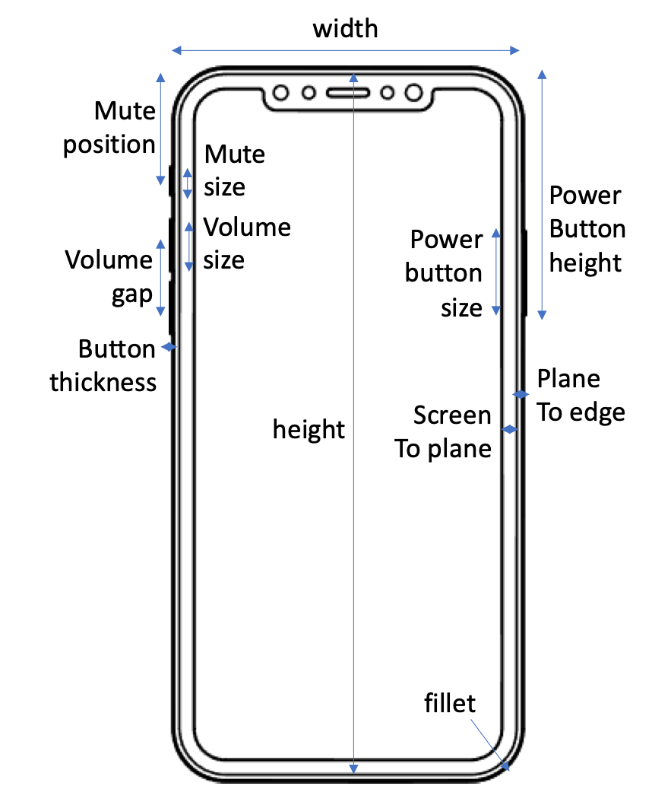
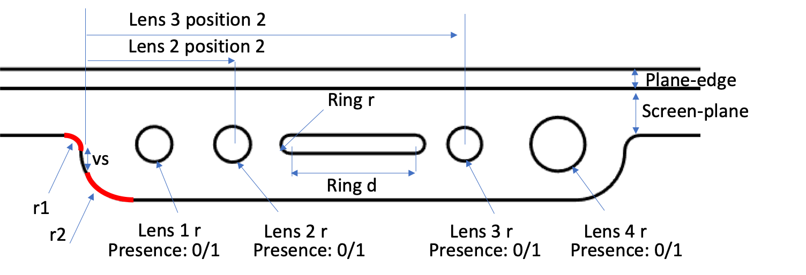
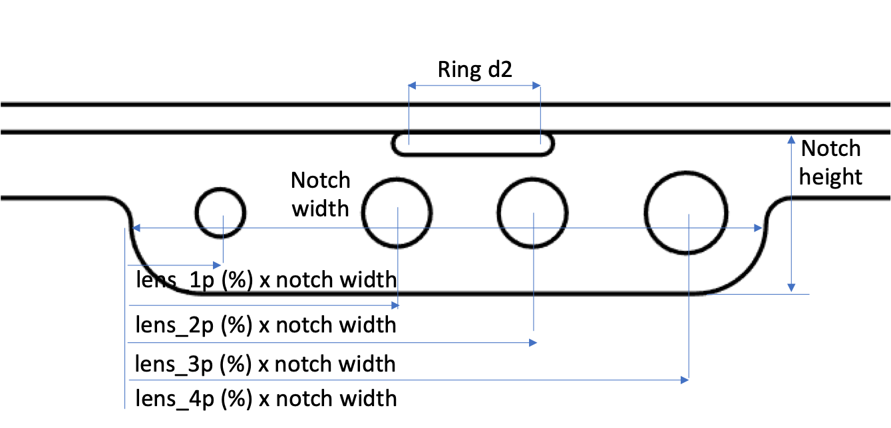
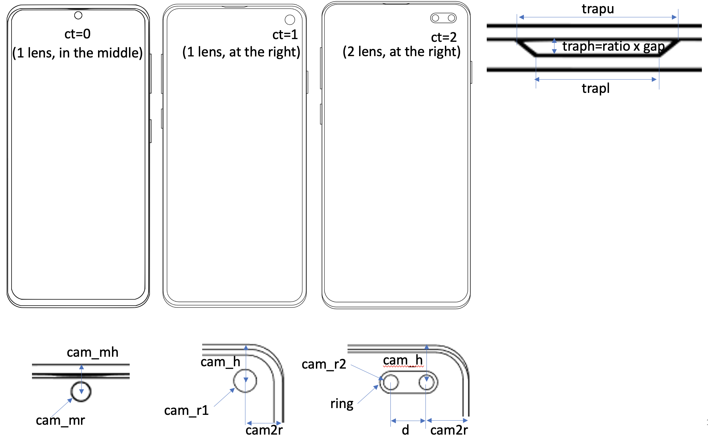
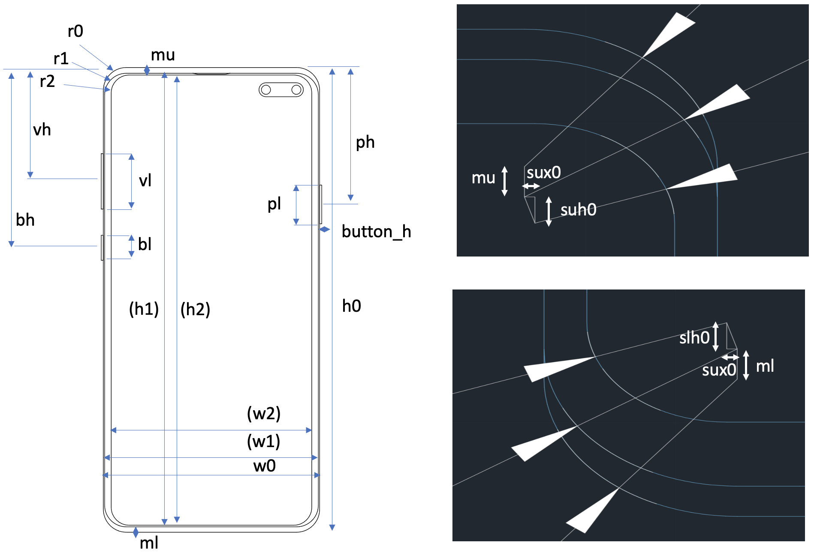

<!DOCTYPE html>
<html>
<head>
</head>
<body>

<h1>BIGNet - Phone</h1>
<h4><a href="https://drive.google.com/file/d/1qFROn8uz7wG6HjcUkMC8Rdc0atgCuA22/view?usp=share_link">[Paper]</a></h4>

This page is the implementation of BIGNet in the phone case study. Car case study implementation can be found <a href="https://github.com/parksandrecfan/bignet-car"><b>here</b>.

<h2>Project summary</h2>

Identifying and codifying brand-related aesthetic features for produc redesign is essential yet challenging, even for humans. This project demonstrates a deep learning, data-driven way to automatically learn brand-related features through SVG-based supervised learning, using brand identification graph neural network (<b>BIGNet</b>), a hierarichal graph neural network.

Our approach conducting the phone study can be summarized in this flow chart:

<h2>System requirements</h2>

The hardware information can be found in <b>Hardware Overview.txt</b>.

The required (Python) packages can be found in <b>requirements.txt</b>.

In addition, <a href="https://potrace.sourceforge.net/"><b>potrace</b></a></b> has to be downloaded to create dataset (step 1).

<h2>Instruction</h2>

An easy-to-follow process is to <b>run the jupyter notebooks in order from 0~7</b>. However, we did provide all the staged results to save implementers time. Downloading the GNN-dataset can skip step 1, and downloading the trained model can skip step 2, and they can both be time-consuming to run. More details are described below.

<h3>Code structure</h3>

All utility functions are in the <b>util directory folder</b>. The individual notebooks call from the utility folders' functions and demonstrate each step in sections.

<h3>Dataset</h3>

The synthetic SVG dataset is generated by parameter interpolation. The parameters are measured manually in dim.xlsx.

Running 0.phone parameters.ipynb will then initialize the measured parameters from dim.xlsx. You can also just download the <a href="https://drive.google.com/file/d/1iMmRQGIC27pujTU5DCMRU4GEhUn6kmsH/view?usp=share_link">iphone_par.pkl </a> and <a href="https://drive.google.com/file/d/1Urg1TpPixGE6gScP4AicJVnM7wKaZbLD/view?usp=share_link">samsung_par.pkl</a> and put in current directory. 

Next, the synthesis code is in 1.create_dataset.ipynb. The results generated will locate at pkl directory. The relationship of parameter names and phone features are shown in the following figure:

<h3>iPhone:</h3>

<h3>Samsung:</h3>

Instead of generating synthetic data from scratch, one can also directly download the SVG dataset from <a href=https://drive.google.com/file/d/1EHMhK5YhudFL1mEfMslS2hXQ92VLCOcK/view?usp=sharing><b>here</b></a>.

The SVG data are reprocessed to a BIGNet-friendly format. One can use this function in util to process from SVG data. One can also directly download the pickle format <a href=https://drive.google.com/file/d/1FgSsBIPzOgKaXGAYXavOU56oW8111gu4/view?usp=sharing><b>here</b></a>. Do note that to continue down the pipeline, put the decompressed data in a "pkl" directory.

<h3>Training</h3>

Training takes 8 formatted pickle files (train/test data/curve label/brand label/distance matrix).

<h3>Evaluation</h3>

Dimension reduction of 2D/3D PCA/tSNE is done in 3.dimension reduction.ipynb.

Leave-one-feature-out is implemented in ablation study.ipynb. You can find the brand-relevant and irrelevant features in the ablation folder. Here are some examples. The partial (1000 samples) set of visualization results can be downloaded <a href="https://drive.google.com/file/d/1PwrxeLgwya7I41y2onD2hgMjsjUyvFD0/view?usp=share_link"><b>here</b></a>.

From the LOFO result we can summarize the following brand-relevant features.

<b>Parameter exrapolation study</b>

We performed extrapolation 3 following experiments:

* Apple's lens horizontal location -> extrapolation iphone width.ipynb

* Apple's width and fillet radius -> extrapolation lens1p.ipynb

* Samsung's gap from screen-frame -> extrapolation samsung scr2pl2edge.ipynb

For any questions implementing, feel free to email Sean Chen as yuhsuan2@andrew.cmu.edu

</body>
</html>
